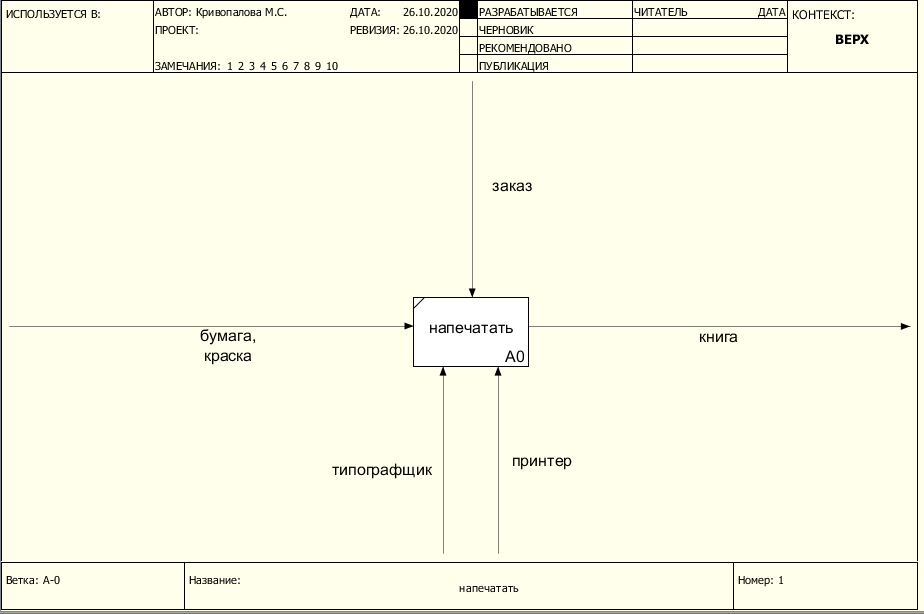
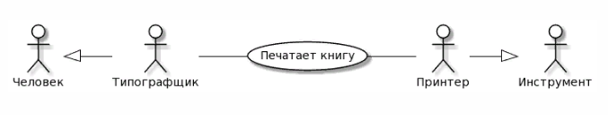
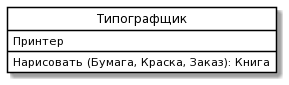

# mayakriv.github.io
# Отчет о лабораторных работах Кривопалова М.С. [идб-17-07](https://github.com/stankin/design-part-1/wiki/list-idb-17-07)
## Лабораторная 1

### RAMUS - программное средство разработки структурно-функциональных моделей
Текст с постановкой задачи: Типографщик должен напечатать книгу

Текст после построения диаграммы: Типографщик напечатал книгу по заказу с помощью принтера, используя бумагу и краску.

### PLANTUML - программное средство автоматической генерации UML-диаграмм
#### Class diagram

#### Usecase diagram

